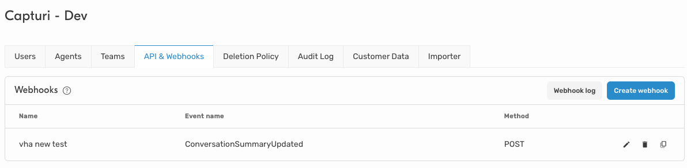
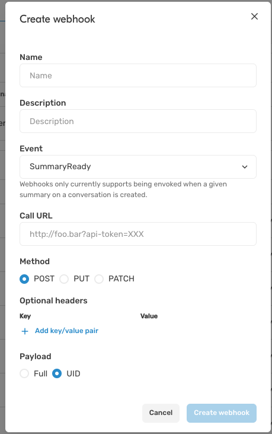
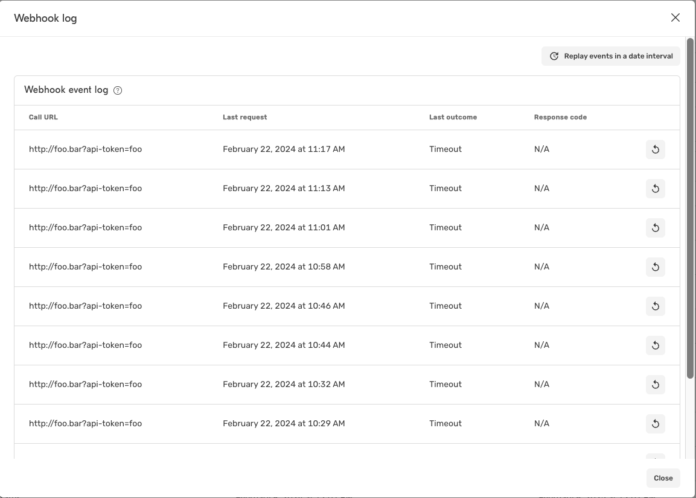

# Capturi Webhooks


You can configure a _webhook_ in Capturi to have us make a request when _something of interest_ happens to any given `Url` with which you can trigger the action you need.

We can either send the full data model or just the identity of the entity so that you can decide whether you need to fetch the full model using our Integration API or whether the identity is enough to trigger the action you need.


## How to create new webhook

In the Capturi App, under `Settings > Organization > API & Webhooks`



From here you can see all the configured webhooks and create a new webhook using `Create webhook`



The options are:

- **Name**
  - Name shown in the list to help identity a webhook
- **Description**
  - Optional description, you can use this to describe what you use the webhook for (_for your own reference later_)
- **Event**
  - Here you can choose between the different events for which we can trigger a webhook request
- **Call URL**
  - The URL, including any query parameters, you want us to make a request against
- **Method**
  - The HTTP verb used (_you can only select between verbs that allow a body to be included_)
- **Optional headers**
  - If you require the request to contain specific headers/values, you can configure these here
- **Payload**
  - Whether we should send the full model (_see Integration API for the relevant models used depending on event_) or only the identity (_Uid_).


### Events

These are the event types you can choose from:

- `SummaryReady`
  - Triggered when a summary is ready / updated (_requires AI Features_)
  - Full model will be based on `IntegrationConversationView` (see [API docs](https://api.capturi.ai/audio/swagger/docs/index.html?version=v2#tag/IntegrationConversations/paths/~1integrations~1conversations~1%7Buid%7D/get) for reference)
- `ConversationProcessed`
  - Triggered when a conversation has been successfully processed
  - Full model will be based on `IntegrationConversationView` (see [API docs](https://api.capturi.ai/audio/swagger/docs/index.html?version=v2#tag/IntegrationConversations/paths/~1integrations~1conversations~1%7Buid%7D/get) for reference)


### Payload

Depending on type of _Payload_ you configure, we will either use the `UidWebhookPayload` or `FullWebhookPayload` as payload for the webhook request we make.

```ts
interface WebhookPayload {
  EventUid: Guid
  Event: 'ConversationSummaryUpdated' | 'ConversationProcessed'
}

interface UidWebhookPayload extends WebhookPayload {
  Uid: Guid
}

interface FullWebhookPayload<T> extends WebhookPayload {
  Entity: T
}
```

The type of `T` for `FullWebhookPayload` will depend on the _Event_, for conversations it will be the `IntegrationConversationView` model from our Integration API.


## Log / Replay

It's possible to see all webhook requets made up to 7 days after they are made, in the `Webhook log` 



From here you can even replay individual requests, or all requests in a given date-period.

This can be useful to verify a request have been made, see what response we got from your service when we made the request as well as replay requests you may have lost due to downtime or other issues in the service receiving our webhook requests.

As noted, **we only store requests for 7 days**, after this it's no longer possible to see or replay events.


## Sample project

Look into [src/](src/) folder for a C# demo project which can receive both a `Uid` and `Full` payload.

We have used [nswag](https://github.com/RicoSuter/NSwag) to auto-generate a client stub of our Integration API, which gives us a model of `IntegrationConversationView` which is the payload for the `Full` model of the event, used in the sample.